# ePawatech — Stage 2 Schema Proposal
_Pre-migration deliverables: A · B · C · D · E_

> [!IMPORTANT]
> This document must be reviewed and approved before any migration SQL is written or applied. Do not proceed to migration files without explicit approval.

---

## Deliverable A — Concrete Schema

### Custom Types (Migration 001)

```sql
CREATE TYPE app_role          AS ENUM ('admin', 'trainer', 'student');
CREATE TYPE profile_status    AS ENUM ('pending', 'active', 'suspended', 'rejected');
CREATE TYPE centre_status     AS ENUM ('active', 'archived');
CREATE TYPE cohort_status     AS ENUM ('planned', 'active', 'completed', 'cancelled');
CREATE TYPE classroom_status  AS ENUM ('active', 'completed', 'archived');
CREATE TYPE assignment_role   AS ENUM ('lead', 'co_teacher');
CREATE TYPE assignment_status AS ENUM ('pending', 'active', 'completed', 'rejected');
CREATE TYPE enrollment_status AS ENUM ('active', 'completed', 'withdrawn', 'removed');
CREATE TYPE curriculum_origin AS ENUM ('master', 'custom');
CREATE TYPE curriculum_state  AS ENUM ('draft', 'live', 'completed', 'hidden');
CREATE TYPE activity_type     AS ENUM (
  'quiz', 'drag-label', 'drag-classify', 'keyboard', 'typing-test',
  'rich-text-editor', 'slide-editor', 'python-runner', 'ai-chat',
  'wokwi-embed', 'youtube-embed', 'html-preview', 'scenario-question', 'external-link'
);
CREATE TYPE attendance_status AS ENUM ('present', 'absent');
CREATE TYPE hw_outcome        AS ENUM ('completed', 'partial', 'not_attempted');
CREATE TYPE progress_status   AS ENUM ('not_started', 'in_progress', 'completed');
CREATE TYPE project_status    AS ENUM ('draft', 'submitted', 'approved', 'rejected');
```

---

### Migration 002 — Profiles and Organization

#### `profiles`
```sql
CREATE TABLE profiles (
  id          UUID PRIMARY KEY,         -- = auth.users.id
  full_name   TEXT NOT NULL DEFAULT '',
  role        app_role NOT NULL DEFAULT 'student',
  status      profile_status NOT NULL DEFAULT 'pending',
  created_at  TIMESTAMPTZ NOT NULL DEFAULT NOW(),
  updated_at  TIMESTAMPTZ NOT NULL DEFAULT NOW()
);
CREATE INDEX idx_profiles_role   ON profiles (role);
CREATE INDEX idx_profiles_status ON profiles (status);
```

Trainer self-signup → `role='trainer', status='pending'`.
Admin sets `status='active'` after approval.
Student self-signup → `role='student', status='active'`.
Admin account created out-of-band → `role='admin', status='active'`.

---

#### `centres`
```sql
CREATE TABLE centres (
  id          UUID PRIMARY KEY DEFAULT gen_random_uuid(),
  name        TEXT NOT NULL,
  description TEXT,
  status      centre_status NOT NULL DEFAULT 'active',
  created_at  TIMESTAMPTZ NOT NULL DEFAULT NOW(),
  updated_at  TIMESTAMPTZ NOT NULL DEFAULT NOW()
);
```

---

#### `cohorts`
```sql
CREATE TABLE cohorts (
  id          UUID PRIMARY KEY DEFAULT gen_random_uuid(),
  centre_id   UUID NOT NULL REFERENCES centres(id),
  name        TEXT NOT NULL,
  status      cohort_status NOT NULL DEFAULT 'planned',
  start_date  DATE,
  end_date    DATE,
  created_at  TIMESTAMPTZ NOT NULL DEFAULT NOW(),
  updated_at  TIMESTAMPTZ NOT NULL DEFAULT NOW()
);
CREATE INDEX idx_cohorts_centre_id ON cohorts (centre_id);
CREATE INDEX idx_cohorts_status    ON cohorts (status);

-- ONE active cohort per centre (enforced at DB level)
CREATE UNIQUE INDEX uidx_one_active_cohort_per_centre
  ON cohorts (centre_id)
  WHERE status = 'active';
```

---

#### `classrooms`
```sql
CREATE TABLE classrooms (
  id              UUID PRIMARY KEY DEFAULT gen_random_uuid(),
  cohort_id       UUID NOT NULL REFERENCES cohorts(id),
  name            TEXT NOT NULL,
  status          classroom_status NOT NULL DEFAULT 'active',
  join_code_hash  TEXT NOT NULL UNIQUE,  -- bcrypt/sha256 of the plain code
  created_by      UUID NOT NULL REFERENCES profiles(id),
  created_at      TIMESTAMPTZ NOT NULL DEFAULT NOW(),
  updated_at      TIMESTAMPTZ NOT NULL DEFAULT NOW()
);
CREATE INDEX idx_classrooms_cohort_id ON classrooms (cohort_id);
CREATE INDEX idx_classrooms_status    ON classrooms (status);
```

Join code lookup: store a hashed code; a secure server function resolves hash → classroom on student join.

---

### Migration 003 — Assignments and Enrollment

#### `trainer_assignments`
```sql
CREATE TABLE trainer_assignments (
  id            UUID PRIMARY KEY DEFAULT gen_random_uuid(),
  trainer_id    UUID NOT NULL REFERENCES profiles(id),
  classroom_id  UUID NOT NULL REFERENCES classrooms(id),
  role          assignment_role NOT NULL DEFAULT 'lead',
  status        assignment_status NOT NULL DEFAULT 'active',
  start_date    DATE,
  end_date      DATE,
  created_at    TIMESTAMPTZ NOT NULL DEFAULT NOW(),
  updated_at    TIMESTAMPTZ NOT NULL DEFAULT NOW()
);
CREATE INDEX idx_ta_trainer_id   ON trainer_assignments (trainer_id);
CREATE INDEX idx_ta_classroom_id ON trainer_assignments (classroom_id);
CREATE INDEX idx_ta_status       ON trainer_assignments (status);

-- ONE active lead per classroom
CREATE UNIQUE INDEX uidx_one_active_lead_per_classroom
  ON trainer_assignments (classroom_id)
  WHERE role = 'lead' AND status = 'active';
```

When a Trainer creates a classroom, an `active lead` assignment row is inserted automatically (via trigger or server function).

---

#### `student_enrollments`
```sql
CREATE TABLE student_enrollments (
  id               UUID PRIMARY KEY DEFAULT gen_random_uuid(),
  student_id       UUID NOT NULL REFERENCES profiles(id),
  classroom_id     UUID NOT NULL REFERENCES classrooms(id),
  status           enrollment_status NOT NULL DEFAULT 'active',
  joined_via_code  BOOLEAN NOT NULL DEFAULT TRUE,
  start_date       DATE,
  end_date         DATE,
  created_at       TIMESTAMPTZ NOT NULL DEFAULT NOW(),
  updated_at       TIMESTAMPTZ NOT NULL DEFAULT NOW()
);
CREATE INDEX idx_se_student_id   ON student_enrollments (student_id);
CREATE INDEX idx_se_classroom_id ON student_enrollments (classroom_id);
CREATE INDEX idx_se_status       ON student_enrollments (status);

-- ONE active enrollment per student (normally)
CREATE UNIQUE INDEX uidx_one_active_enrollment_per_student
  ON student_enrollments (student_id)
  WHERE status = 'active';
```

---

### Migration 004 — Master Curriculum

#### `curriculum_weeks`
```sql
CREATE TABLE curriculum_weeks (
  id          UUID PRIMARY KEY DEFAULT gen_random_uuid(),
  week_number INTEGER NOT NULL UNIQUE,
  title       TEXT NOT NULL,
  description TEXT,
  icon        TEXT,         -- lucide icon name
  sort_order  INTEGER NOT NULL,
  created_at  TIMESTAMPTZ NOT NULL DEFAULT NOW()
);
```

#### `curriculum_modules`
_(Tracks in the existing TypeScript model map here — one Track = one Module in a Week)_
```sql
CREATE TABLE curriculum_modules (
  id          UUID PRIMARY KEY DEFAULT gen_random_uuid(),
  week_id     UUID NOT NULL REFERENCES curriculum_weeks(id),
  slug        TEXT NOT NULL UNIQUE,   -- stable: e.g. 'computer-fundamentals'
  title       TEXT NOT NULL,
  description TEXT,
  sort_order  INTEGER NOT NULL,
  created_at  TIMESTAMPTZ NOT NULL DEFAULT NOW()
);
CREATE INDEX idx_cm_week_id ON curriculum_modules (week_id);
```

#### `curriculum_lessons`
```sql
CREATE TABLE curriculum_lessons (
  id          UUID PRIMARY KEY DEFAULT gen_random_uuid(),
  module_id   UUID NOT NULL REFERENCES curriculum_modules(id),
  slug        TEXT NOT NULL,         -- stable: 'lesson-1', 'lesson-2', …
  title       TEXT NOT NULL,
  topics      TEXT[] NOT NULL DEFAULT '{}',
  sort_order  INTEGER NOT NULL,
  is_challenge BOOLEAN NOT NULL DEFAULT FALSE,
  time_limit_seconds INTEGER,        -- for challenge items only
  created_at  TIMESTAMPTZ NOT NULL DEFAULT NOW(),
  UNIQUE (module_id, slug)
);
CREATE INDEX idx_cl_module_id ON curriculum_lessons (module_id);
```

#### `lesson_activities`
```sql
CREATE TABLE lesson_activities (
  id              UUID PRIMARY KEY DEFAULT gen_random_uuid(),
  lesson_id       UUID NOT NULL REFERENCES curriculum_lessons(id) ON DELETE CASCADE,
  activity_type   activity_type NOT NULL,
  configuration   JSONB NOT NULL DEFAULT '{}',  -- full activity payload
  sort_order      INTEGER NOT NULL DEFAULT 0,
  created_at      TIMESTAMPTZ NOT NULL DEFAULT NOW()
);
CREATE INDEX idx_la_lesson_id ON lesson_activities (lesson_id);
```

`configuration` stores the entire activity-specific JSON (questions array, items/zones, videoId, src, url, etc.). This preserves all 14 activity types without a separate column per variant.

---

### Migration 005 — Classroom Curriculum

#### `classroom_curriculum_items`
```sql
CREATE TABLE classroom_curriculum_items (
  id                  UUID PRIMARY KEY DEFAULT gen_random_uuid(),
  classroom_id        UUID NOT NULL REFERENCES classrooms(id) ON DELETE CASCADE,
  master_activity_id  UUID REFERENCES lesson_activities(id),  -- NULL for 'custom' items
  origin              curriculum_origin NOT NULL DEFAULT 'master',
  title               TEXT NOT NULL,
  configuration       JSONB,         -- NULL means inherit from master
  sort_order          INTEGER NOT NULL,
  state               curriculum_state NOT NULL DEFAULT 'draft',
  removed             BOOLEAN NOT NULL DEFAULT FALSE,
  created_by          UUID NOT NULL REFERENCES profiles(id),
  created_at          TIMESTAMPTZ NOT NULL DEFAULT NOW(),
  updated_at          TIMESTAMPTZ NOT NULL DEFAULT NOW()
);
CREATE INDEX idx_cci_classroom_id       ON classroom_curriculum_items (classroom_id);
CREATE INDEX idx_cci_master_activity_id ON classroom_curriculum_items (master_activity_id);
CREATE INDEX idx_cci_state              ON classroom_curriculum_items (state);
```

#### `classroom_curriculum_overrides`
```sql
CREATE TABLE classroom_curriculum_overrides (
  id                  UUID PRIMARY KEY DEFAULT gen_random_uuid(),
  classroom_id        UUID NOT NULL REFERENCES classrooms(id) ON DELETE CASCADE,
  master_activity_id  UUID NOT NULL REFERENCES lesson_activities(id),
  title_override      TEXT,
  configuration_override JSONB,
  sort_order_override INTEGER,
  removed             BOOLEAN NOT NULL DEFAULT FALSE,
  created_by          UUID NOT NULL REFERENCES profiles(id),
  created_at          TIMESTAMPTZ NOT NULL DEFAULT NOW(),
  updated_at          TIMESTAMPTZ NOT NULL DEFAULT NOW(),
  UNIQUE (classroom_id, master_activity_id)  -- one override per master item per classroom
);
```

---

### Migration 006 — Learning Operations

#### `attendance_sessions`
```sql
CREATE TABLE attendance_sessions (
  id                  UUID PRIMARY KEY DEFAULT gen_random_uuid(),
  classroom_id        UUID NOT NULL REFERENCES classrooms(id) ON DELETE CASCADE,
  curriculum_item_id  UUID REFERENCES classroom_curriculum_items(id),
  session_date        DATE NOT NULL,
  created_by          UUID NOT NULL REFERENCES profiles(id),
  created_at          TIMESTAMPTZ NOT NULL DEFAULT NOW()
);
CREATE INDEX idx_as_classroom_id  ON attendance_sessions (classroom_id);
CREATE INDEX idx_as_session_date  ON attendance_sessions (session_date);
```

#### `attendance_records`
```sql
CREATE TABLE attendance_records (
  id                    UUID PRIMARY KEY DEFAULT gen_random_uuid(),
  attendance_session_id UUID NOT NULL REFERENCES attendance_sessions(id) ON DELETE CASCADE,
  student_id            UUID NOT NULL REFERENCES profiles(id),
  status                attendance_status NOT NULL,
  created_at            TIMESTAMPTZ NOT NULL DEFAULT NOW(),
  updated_at            TIMESTAMPTZ NOT NULL DEFAULT NOW(),
  UNIQUE (attendance_session_id, student_id)   -- one record per student per session
);
CREATE INDEX idx_ar_session_id ON attendance_records (attendance_session_id);
CREATE INDEX idx_ar_student_id ON attendance_records (student_id);
```

#### `challenge_assignments`
```sql
CREATE TABLE challenge_assignments (
  id           UUID PRIMARY KEY DEFAULT gen_random_uuid(),
  challenge_id UUID NOT NULL REFERENCES curriculum_lessons(id),  -- is_challenge=true
  classroom_id UUID NOT NULL REFERENCES classrooms(id) ON DELETE CASCADE,
  assigned_by  UUID NOT NULL REFERENCES profiles(id),
  due_date     DATE,
  created_at   TIMESTAMPTZ NOT NULL DEFAULT NOW(),
  updated_at   TIMESTAMPTZ NOT NULL DEFAULT NOW(),
  UNIQUE (classroom_id, challenge_id)
);
CREATE INDEX idx_ca_classroom_id ON challenge_assignments (classroom_id);
```

#### `hardware_sessions`
```sql
CREATE TABLE hardware_sessions (
  id                 UUID PRIMARY KEY DEFAULT gen_random_uuid(),
  classroom_id       UUID NOT NULL REFERENCES classrooms(id) ON DELETE CASCADE,
  curriculum_item_id UUID REFERENCES classroom_curriculum_items(id),
  session_date       DATE NOT NULL,
  notes              TEXT,
  created_by         UUID NOT NULL REFERENCES profiles(id),
  created_at         TIMESTAMPTZ NOT NULL DEFAULT NOW(),
  updated_at         TIMESTAMPTZ NOT NULL DEFAULT NOW()
);
CREATE INDEX idx_hs_classroom_id ON hardware_sessions (classroom_id);
```

#### `hardware_session_outcomes`
```sql
CREATE TABLE hardware_session_outcomes (
  id                  UUID PRIMARY KEY DEFAULT gen_random_uuid(),
  hardware_session_id UUID NOT NULL REFERENCES hardware_sessions(id) ON DELETE CASCADE,
  student_id          UUID NOT NULL REFERENCES profiles(id),
  outcome             hw_outcome NOT NULL DEFAULT 'not_attempted',
  notes               TEXT,
  created_at          TIMESTAMPTZ NOT NULL DEFAULT NOW(),
  updated_at          TIMESTAMPTZ NOT NULL DEFAULT NOW(),
  UNIQUE (hardware_session_id, student_id)
);
CREATE INDEX idx_hso_student_id ON hardware_session_outcomes (student_id);
```

#### `hardware_evidence`
```sql
CREATE TABLE hardware_evidence (
  id                  UUID PRIMARY KEY DEFAULT gen_random_uuid(),
  hardware_session_id UUID REFERENCES hardware_sessions(id),
  student_id          UUID REFERENCES profiles(id),
  uploaded_by         UUID NOT NULL REFERENCES profiles(id),
  storage_path        TEXT NOT NULL,     -- Supabase Storage object path
  file_name           TEXT NOT NULL,
  mime_type           TEXT NOT NULL,
  file_size           BIGINT,
  created_at          TIMESTAMPTZ NOT NULL DEFAULT NOW()
);
```

#### `weekly_student_comments`
```sql
CREATE TABLE weekly_student_comments (
  id           UUID PRIMARY KEY DEFAULT gen_random_uuid(),
  student_id   UUID NOT NULL REFERENCES profiles(id),
  classroom_id UUID NOT NULL REFERENCES classrooms(id) ON DELETE CASCADE,
  trainer_id   UUID NOT NULL REFERENCES profiles(id),
  week_number  INTEGER NOT NULL CHECK (week_number BETWEEN 1 AND 20),
  comment      TEXT NOT NULL,
  created_at   TIMESTAMPTZ NOT NULL DEFAULT NOW(),
  updated_at   TIMESTAMPTZ NOT NULL DEFAULT NOW(),
  UNIQUE (student_id, classroom_id, trainer_id, week_number)
);
CREATE INDEX idx_wsc_student_id   ON weekly_student_comments (student_id);
CREATE INDEX idx_wsc_classroom_id ON weekly_student_comments (classroom_id);
CREATE INDEX idx_wsc_week_number  ON weekly_student_comments (week_number);
```

#### `lesson_progress`
```sql
CREATE TABLE lesson_progress (
  id                     UUID PRIMARY KEY DEFAULT gen_random_uuid(),
  student_id             UUID NOT NULL REFERENCES profiles(id),
  classroom_id           UUID NOT NULL REFERENCES classrooms(id),
  curriculum_activity_id UUID NOT NULL REFERENCES lesson_activities(id),
  status                 progress_status NOT NULL DEFAULT 'not_started',
  progress_data          JSONB DEFAULT '{}',   -- score, wpm, attempts, etc.
  started_at             TIMESTAMPTZ,
  completed_at           TIMESTAMPTZ,
  updated_at             TIMESTAMPTZ NOT NULL DEFAULT NOW(),
  UNIQUE (student_id, classroom_id, curriculum_activity_id)
);
CREATE INDEX idx_lp_student_id   ON lesson_progress (student_id);
CREATE INDEX idx_lp_classroom_id ON lesson_progress (classroom_id);
```

#### `projects` (Week 8 — already referenced in lib/supabase.ts)
```sql
CREATE TABLE projects (
  id           UUID PRIMARY KEY DEFAULT gen_random_uuid(),
  student_id   UUID NOT NULL REFERENCES profiles(id),
  classroom_id UUID REFERENCES classrooms(id),
  title        TEXT NOT NULL,
  description  TEXT NOT NULL,
  image_url    TEXT,
  video_url    TEXT,
  storage_path TEXT,    -- Supabase Storage path for uploaded image
  status       project_status NOT NULL DEFAULT 'submitted',
  created_at   TIMESTAMPTZ NOT NULL DEFAULT NOW(),
  updated_at   TIMESTAMPTZ NOT NULL DEFAULT NOW()
);
CREATE INDEX idx_projects_student_id ON projects (student_id);
CREATE INDEX idx_projects_status     ON projects (status);
```

---

### Migration 007 — Audit

#### `audit_logs`
```sql
CREATE TABLE audit_logs (
  id          UUID PRIMARY KEY DEFAULT gen_random_uuid(),
  actor_id    UUID NOT NULL REFERENCES profiles(id),
  action      TEXT NOT NULL,
  entity_type TEXT NOT NULL,
  entity_id   UUID,
  reason      TEXT,
  before_data JSONB,
  after_data  JSONB,
  metadata    JSONB,
  created_at  TIMESTAMPTZ NOT NULL DEFAULT NOW()
);
-- UPDATE and DELETE revoked via RLS: no role may modify audit records
```

---

## Deliverable B — Relationship Diagram

```mermaid
erDiagram
    profiles {
        uuid id PK
        text full_name
        app_role role
        profile_status status
    }

    centres {
        uuid id PK
        text name
        centre_status status
    }

    cohorts {
        uuid id PK
        uuid centre_id FK
        text name
        cohort_status status
        date start_date
        date end_date
    }

    classrooms {
        uuid id PK
        uuid cohort_id FK
        uuid created_by FK
        text name
        classroom_status status
        text join_code_hash
    }

    trainer_assignments {
        uuid id PK
        uuid trainer_id FK
        uuid classroom_id FK
        assignment_role role
        assignment_status status
    }

    student_enrollments {
        uuid id PK
        uuid student_id FK
        uuid classroom_id FK
        enrollment_status status
        boolean joined_via_code
    }

    curriculum_weeks {
        uuid id PK
        int week_number
        text title
    }

    curriculum_modules {
        uuid id PK
        uuid week_id FK
        text slug
        text title
    }

    curriculum_lessons {
        uuid id PK
        uuid module_id FK
        text slug
        text title
        boolean is_challenge
    }

    lesson_activities {
        uuid id PK
        uuid lesson_id FK
        activity_type activity_type
        jsonb configuration
    }

    classroom_curriculum_items {
        uuid id PK
        uuid classroom_id FK
        uuid master_activity_id FK
        curriculum_origin origin
        text title
        jsonb configuration
        int sort_order
        curriculum_state state
        boolean removed
    }

    classroom_curriculum_overrides {
        uuid id PK
        uuid classroom_id FK
        uuid master_activity_id FK
        text title_override
        jsonb configuration_override
        boolean removed
    }

    attendance_sessions {
        uuid id PK
        uuid classroom_id FK
        date session_date
    }

    attendance_records {
        uuid id PK
        uuid attendance_session_id FK
        uuid student_id FK
        attendance_status status
    }

    hardware_sessions {
        uuid id PK
        uuid classroom_id FK
        date session_date
    }

    hardware_session_outcomes {
        uuid id PK
        uuid hardware_session_id FK
        uuid student_id FK
        hw_outcome outcome
    }

    hardware_evidence {
        uuid id PK
        uuid hardware_session_id FK
        uuid student_id FK
        text storage_path
    }

    challenge_assignments {
        uuid id PK
        uuid challenge_id FK
        uuid classroom_id FK
    }

    weekly_student_comments {
        uuid id PK
        uuid student_id FK
        uuid classroom_id FK
        uuid trainer_id FK
        int week_number
        text comment
    }

    lesson_progress {
        uuid id PK
        uuid student_id FK
        uuid classroom_id FK
        uuid curriculum_activity_id FK
        progress_status status
        jsonb progress_data
    }

    projects {
        uuid id PK
        uuid student_id FK
        uuid classroom_id FK
        project_status status
    }

    audit_logs {
        uuid id PK
        uuid actor_id FK
        text action
        text entity_type
    }

    centres ||--o{ cohorts : "has"
    cohorts ||--o{ classrooms : "has"
    profiles ||--o{ classrooms : "created_by"
    profiles ||--o{ trainer_assignments : "trainer"
    classrooms ||--o{ trainer_assignments : "assigned to"
    profiles ||--o{ student_enrollments : "student"
    classrooms ||--o{ student_enrollments : "enrolled in"
    curriculum_weeks ||--o{ curriculum_modules : "has"
    curriculum_modules ||--o{ curriculum_lessons : "has"
    curriculum_lessons ||--o{ lesson_activities : "has"
    classrooms ||--o{ classroom_curriculum_items : "has"
    lesson_activities ||--o{ classroom_curriculum_items : "master"
    classrooms ||--o{ classroom_curriculum_overrides : "overrides"
    lesson_activities ||--o{ classroom_curriculum_overrides : "overrides"
    classrooms ||--o{ attendance_sessions : "has"
    attendance_sessions ||--o{ attendance_records : "records"
    profiles ||--o{ attendance_records : "student"
    classrooms ||--o{ hardware_sessions : "has"
    hardware_sessions ||--o{ hardware_session_outcomes : "outcomes"
    hardware_sessions ||--o{ hardware_evidence : "evidence"
    profiles ||--o{ weekly_student_comments : "student"
    classrooms ||--o{ weekly_student_comments : "classroom"
    curriculum_lessons ||--o{ challenge_assignments : "challenge"
    classrooms ||--o{ challenge_assignments : "classroom"
    lesson_activities ||--o{ lesson_progress : "activity"
    profiles ||--o{ lesson_progress : "student"
    profiles ||--o{ projects : "student"
    classrooms ||--o{ projects : "classroom"
    profiles ||--o{ audit_logs : "actor"
```



---

## Deliverable C — RLS Strategy

### Core helper functions (created in Migration 008)

```sql
-- Returns true if the calling user is an active admin
CREATE OR REPLACE FUNCTION is_admin()
RETURNS BOOLEAN LANGUAGE sql STABLE SECURITY DEFINER AS $$
  SELECT EXISTS (
    SELECT 1 FROM profiles
    WHERE id = auth.uid() AND role = 'admin' AND status = 'active'
  )
$$;

-- Returns true if calling user is an active trainer for the given classroom
CREATE OR REPLACE FUNCTION is_active_trainer_for_classroom(p_classroom_id UUID)
RETURNS BOOLEAN LANGUAGE sql STABLE SECURITY DEFINER AS $$
  SELECT EXISTS (
    SELECT 1 FROM trainer_assignments ta
    JOIN profiles p ON p.id = ta.trainer_id
    WHERE ta.trainer_id = auth.uid()
      AND ta.classroom_id = p_classroom_id
      AND ta.status = 'active'
      AND p.status = 'active'
  )
$$;

-- Returns true if calling user is an active student enrolled in the given classroom
CREATE OR REPLACE FUNCTION is_active_student_in_classroom(p_classroom_id UUID)
RETURNS BOOLEAN LANGUAGE sql STABLE SECURITY DEFINER AS $$
  SELECT EXISTS (
    SELECT 1 FROM student_enrollments se
    JOIN profiles p ON p.id = se.student_id
    WHERE se.student_id = auth.uid()
      AND se.classroom_id = p_classroom_id
      AND se.status = 'active'
      AND p.status = 'active'
  )
$$;
```

### Per-table RLS policies

| Table | Admin | Trainer | Student |
|---|---|---|---|
| `profiles` | Full access | Read own row; update own non-role fields | Read own row; update own non-role fields |
| `centres` | Full CRUD | Read only (active centres/cohorts in their assignment) | No access |
| `cohorts` | Full CRUD | Read active cohorts (to create classroom) | No access |
| `classrooms` | Full CRUD | Read/update own classroom; create under active cohort if approved | Read own enrolled classroom |
| `trainer_assignments` | Full CRUD | Read own assignments | No access |
| `student_enrollments` | Full CRUD | Read enrollments for own classroom | Read own enrollment |
| `curriculum_weeks` | Full CRUD | SELECT | SELECT |
| `curriculum_modules` | Full CRUD | SELECT | SELECT |
| `curriculum_lessons` | Full CRUD | SELECT | SELECT |
| `lesson_activities` | Full CRUD | SELECT | SELECT |
| `classroom_curriculum_items` | Full CRUD | Full CRUD for own classroom | SELECT where not removed AND state IN ('live','completed') |
| `classroom_curriculum_overrides` | Full CRUD | Full CRUD for own classroom | No direct access |
| `attendance_sessions` | Full CRUD | Full CRUD for own classroom | SELECT own classroom sessions |
| `attendance_records` | Full CRUD | Full CRUD for own classroom sessions | SELECT own records only |
| `challenge_assignments` | Full CRUD | Full CRUD for own classroom | SELECT for own classroom |
| `hardware_sessions` | Full CRUD | Full CRUD for own classroom | SELECT for own classroom |
| `hardware_session_outcomes` | Full CRUD | Full CRUD for own classroom | SELECT own outcome only |
| `hardware_evidence` | Full CRUD | Full CRUD for own classroom | SELECT own evidence only |
| `weekly_student_comments` | Full CRUD | Full CRUD for own classroom | SELECT own comments |
| `lesson_progress` | Full CRUD | Read for own classroom students | Full CRUD own progress only |
| `projects` | Full CRUD | Read/approve for own classroom | Full CRUD own projects |
| `audit_logs` | INSERT only | No access | No access |

> [!WARNING]
> `audit_logs` must have `UPDATE` and `DELETE` revoked at the PostgreSQL level with `REVOKE UPDATE, DELETE ON audit_logs FROM authenticated, anon;`. RLS alone is insufficient for immutability.

---

## Deliverable D — Curriculum Mapping

### `lib/curriculum.ts` → PostgreSQL

Each TypeScript `Track` maps as follows:

```text
Track                →  curriculum_modules (one row per track)
Track.weekNumber     →  curriculum_weeks.week_number
Track.slug           →  curriculum_modules.slug
Track.lessons[]      →  curriculum_lessons (one row per lesson, is_challenge=false)
Track.challenge      →  curriculum_lessons (one row, is_challenge=true)
Lesson.activity      →  lesson_activities (one row, configuration=full JSON)
```

### Full seed mapping (all 7 weeks + Week 8)

| Week | Module slug | Lessons | Challenge | Activity types used |
|---|---|---|---|---|
| 1 | `computer-fundamentals` | 5 | Yes | quiz, drag-label, drag-classify |
| 2 | `digital-productivity` | 5 | Yes | keyboard, typing-test, rich-text-editor, slide-editor, quiz |
| 3 | `data-skills` | 2 | Yes | python-runner |
| 4 | `digital-citizenship` | 3 | No | scenario-question, external-link, html-preview |
| 5 | `ai-and-prompting` | 3 | Yes | quiz, ai-chat |
| 6 | `coding-and-arduino` | 4 | Yes | python-runner, wokwi-embed, quiz |
| 7 | `traffic-and-sensors` | 3 | Yes | python-runner, youtube-embed |
| **8** | **`final-projects-showcase`** | **1** | **No** | **`external-link` / custom** |

### Week 8 — Projects mapping

Week 8 is already implemented as `project-showcase.tsx`. It does not follow the `Track → Lesson → Activity` structure — it is a free-form submission page. The database mapping treats it as:

```text
curriculum_weeks  → week_number=8, title='Final Projects & Showcase'
curriculum_modules → slug='final-projects-showcase', title='Final Projects & Showcase'
curriculum_lessons → slug='submission', title='Submit Your Project', is_challenge=false
lesson_activities  → activity_type='external-link', configuration={
                        "instruction": "Submit a photo of your project and an optional YouTube link.",
                        "url": "/projects",
                        "title": "Final Projects & Showcase"
                     }
```

Student progress for Week 8 is tracked via `lesson_progress` with the `curriculum_activity_id` pointing to this activity. The `projects` table handles the actual submission data, linked to the student and classroom.

### `configuration` JSON examples per activity type

| Type | Configuration shape |
|---|---|
| `quiz` | `{ "questions": [{ "question": "...", "options": [...], "correctIndex": 0 }] }` |
| `drag-label` | `{ "instruction": "...", "items": [...], "zones": [...] }` |
| `drag-classify` | `{ "instruction": "...", "items": [...], "zones": [...] }` |
| `keyboard` | `{ "instruction": "..." }` |
| `typing-test` | `{ "instruction": "..." }` |
| `rich-text-editor` | `{ "mission": "...", "requiredFormats": [...] }` |
| `slide-editor` | `{ "instruction": "..." }` |
| `python-runner` | `{ "instruction": "...", "initialCode": "..." }` |
| `ai-chat` | `{ "instruction": "...", "starterPrompt": "..." }` |
| `wokwi-embed` | `{ "instruction": "...", "src": "...", "title": "..." }` |
| `youtube-embed` | `{ "instruction": "...", "videoId": "...", "title": "..." }` |
| `html-preview` | `{ "instruction": "...", "initialHtml": "...", "initialCss": "..." }` |
| `scenario-question` | `{ "scenario": "...", "options": [...], "correctIndex": 0 }` |
| `external-link` | `{ "instruction": "...", "url": "...", "title": "..." }` |

---

## Deliverable E — localStorage to Database Mapping

The Trainer Dashboard currently persists state under `localStorage key: "ePawatech_trainer_demo_state"`:

```json
{
  "modules": [ Module[] ],
  "attendance": { "StudentName": "Present|Absent" },
  "awards": [ { "student": "...", "badge": "...", "date": "..." } ]
}
```

### `modules` → `classroom_curriculum_items` + `classroom_curriculum_overrides`

| localStorage field | Database column | Notes |
|---|---|---|
| `Module.id` | `curriculum_modules.slug` | Used to find the master module |
| `CurriculumItem.id` | Resolves to `lesson_activities.id` | `{track.slug}-{lesson.slug}` pattern |
| `CurriculumItem.origin = "core"` | `classroom_curriculum_items.origin = 'master'` | Inherited item |
| `CurriculumItem.origin = "trainer"` | `classroom_curriculum_items.origin = 'custom'` | Custom addition |
| `CurriculumItem.removed = true` | `classroom_curriculum_overrides.removed = true` | Soft removal |
| `CurriculumItem.title ≠ masterTitle` | `classroom_curriculum_overrides.title_override` | Title override |
| `CurriculumItem.instruction ≠ masterInstruction` | `classroom_curriculum_overrides.configuration_override` | Instruction override |
| `CurriculumItem.sort_order` (implicit array index) | `classroom_curriculum_items.sort_order` | Classroom ordering |
| `CurriculumItem.activity` | `lesson_activities.configuration` | For custom items: stored in `classroom_curriculum_items.configuration` |

### `attendance` → `attendance_records`

| localStorage field | Database path |
|---|---|
| `attendance["StudentName"] = "Present"` | `attendance_records.status = 'present'` |
| `attendance["StudentName"] = "Absent"` | `attendance_records.status = 'absent'` |
| (implicit: today's date) | `attendance_sessions.session_date` |

Note: localStorage stores attendance by student **name** (mock data). The database uses `student_id` (UUID). Migration must map mock names to real profiles.

### `awards` → deferred

The `awards` array in localStorage (badge awards) maps to the deferred badge/gamification system. No database table for it in Stage 2.

---

## Migration Sequence Summary

| File | Content |
|---|---|
| `001_extensions_types.sql` | `uuid-ossp` extension + all ENUM types |
| `002_profiles_organization.sql` | `profiles`, `centres`, `cohorts`, `classrooms` |
| `003_assignments_enrollment.sql` | `trainer_assignments`, `student_enrollments` |
| `004_master_curriculum.sql` | `curriculum_weeks`, `curriculum_modules`, `curriculum_lessons`, `lesson_activities` |
| `004_seed_curriculum.sql` | INSERT rows seeded from `lib/curriculum.ts` (all 7 weeks + Week 8) |
| `005_classroom_curriculum.sql` | `classroom_curriculum_items`, `classroom_curriculum_overrides` |
| `006_learning_operations.sql` | `attendance_sessions`, `attendance_records`, `challenge_assignments`, `hardware_sessions`, `hardware_session_outcomes`, `hardware_evidence`, `weekly_student_comments`, `lesson_progress`, `projects` |
| `007_audit.sql` | `audit_logs` + REVOKE |
| `008_rls.sql` | Enable RLS + all policies + helper functions |
| `009_seed_compatibility.sql` | Triggers (profile auto-create on auth.users insert), functions |

---

## Open Items (No Blockers to Schema Approval)

1. **Supabase project credentials** — needed before migrations can run. Provide `NEXT_PUBLIC_SUPABASE_URL` and `NEXT_PUBLIC_SUPABASE_ANON_KEY` and they will be added to `.env.local`.

2. **Join code hashing** — the schema stores `join_code_hash`. A server-side function will generate and validate codes. The plain code is shown only to the trainer; only the hash is persisted.

3. **Profile auto-creation trigger** — a `AFTER INSERT ON auth.users` trigger will automatically create a `profiles` row. This is standard Supabase practice.

4. **Classroom creation gating** — a Trainer must have `profile.status = 'active'` (i.e. be approved) before they can create a classroom. This is enforced by RLS on `classrooms` INSERT.

5. **`projects` table** — included in Stage 2 since `lib/supabase.ts` already references it and Week 8 requires it.
